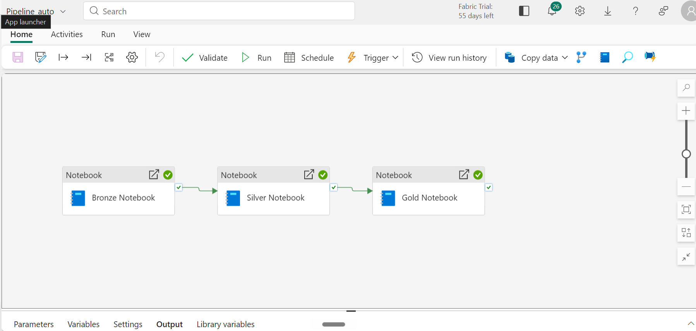
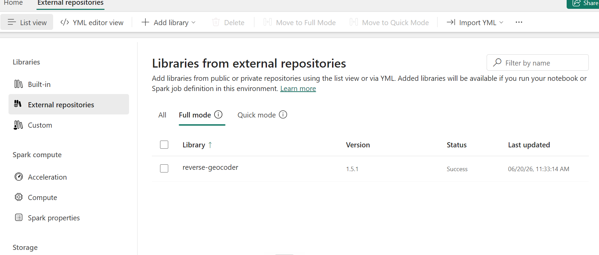
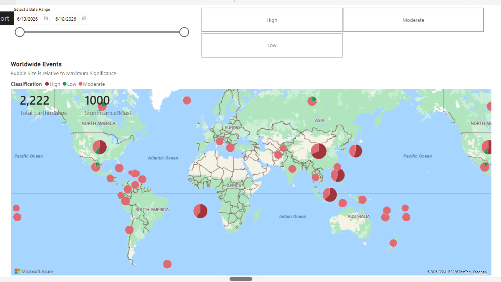

# Earthquake Data Engineering Project with Microsoft Fabric

End-to-end data engineering and analytics pipeline built on **Microsoft Fabric**, using the Medallion (Bronze/Silver/Gold) architecture to ingest, process, and visualize real-world earthquake event data.


*Fabric Data Factory pipeline orchestrating the Bronze → Silver → Gold notebook chain*

---

## Project Overview

This project demonstrates how to build a complete data engineering and analysis pipeline utilizing Microsoft Fabric's **Data Factory**, **Data Engineering (Spark Notebooks)**, and **Power BI** experiences.

Earthquake event data is ingested from the [USGS Earthquake API](https://earthquake.usgs.gov/), processed through progressively refined layers, and surfaced as an interactive Power BI report for analysis and reporting.

**Technologies Used:** Python, PySpark, Microsoft Fabric (Data Engineering, Data Factory, Lakehouse), Power BI

---

## Architecture

```
USGS Earthquake API
        │
        ▼
   Bronze Layer   →  Raw ingestion, minimal processing
        │
        ▼
   Silver Layer   →  Cleaned, transformed, deduplicated
        │
        ▼
    Gold Layer    →  Business-ready, aggregated datasets
        │
        ▼
     Power BI     →  Interactive worldwide earthquake report
```

The full pipeline is orchestrated end-to-end in a single Fabric Data Factory pipeline, chaining the three notebooks with validation checks at each stage:


---

## Repository Contents

| Notebook | Description |
|---|---|
| `Worldwide Earthquake Events API - Bronze Layer Processing` | Ingests raw earthquake data from the USGS API and stores it in its original format in the Lakehouse, serving as the foundational layer for further refinement. |
| `Worldwide Earthquake Events API - Silver Layer Processing` | Cleans, transforms, and consolidates Bronze layer data — handling schema enforcement, deduplication, and data type corrections — to prepare it for analytical use. |
| `Worldwide Earthquake Events API - Gold Layer Processing` | Refines Silver layer data into business-ready, aggregated datasets optimized for high-value insights and visualization in Power BI. |

### Spark Environment

The Gold layer notebook performs reverse geocoding to enrich raw coordinates with place descriptions, using the `reverse-geocoder` library installed as a custom Spark environment dependency:



---

## Data Attribute Definitions

| Attribute | Type | Description |
|---|---|---|
| `id` | string | Unique identifier for each earthquake event record |
| `latitude` | double | Latitude of the event |
| `longitude` | double | Longitude of the event |
| `elevation` | double | Elevation at which the event occurred, in meters |
| `title` | string | Title or name of the event |
| `place_description` | string | Descriptive location of the event |
| `sig` | bigint | Significance score of the event |
| `mag` | double | Magnitude of the earthquake |
| `magType` | string | Magnitude scale type used (e.g., mb, ml, mw) |
| `time` | timestamp | Exact time the event occurred |
| `updated` | timestamp | Last update time for the event record |

---

## Power BI Dashboard

The Gold layer feeds a Power BI report visualizing worldwide earthquake activity, with filters for date range and significance classification (High / Moderate / Low):

 

**Key features:**
- Interactive world map with bubble size scaled to maximum significance
- Date range slicer for time-bound analysis
- Significance classification filters (High / Moderate / Low)
- Real-time KPIs: total earthquake count and maximum significance score

---

## Prerequisites

- Microsoft Fabric account (trial or licensed)
- Fabric Administrator access, or access to an individual with an Admin account
- Familiarity with Python, Spark, and basic data engineering concepts
- Basic Power BI skills

---

## Getting Started

1. Clone or download this repository.
2. Import the three notebooks (`Bronze`, `Silver`, `Gold`) into a Fabric workspace.
3. Attach each notebook to a Fabric Lakehouse.
4. Add the `reverse-geocoder` library to your Spark environment (Environment → Custom Libraries → PyPI).
5. Run the notebooks in order: **Bronze → Silver → Gold**.
6. Connect Power BI to the Gold layer tables and build/import the report.
7. (Optional) Orchestrate all three notebooks in a Data Factory pipeline for scheduled, automated runs.

---

## Skills Demonstrated

- Medallion architecture (Bronze/Silver/Gold) design and implementation
- PySpark data ingestion, transformation, and enrichment
- REST API integration for data ingestion
- Custom Spark library/environment configuration
- Pipeline orchestration with Microsoft Fabric Data Factory
- Power BI dashboard design with geospatial visualization and interactive filtering

---

## Author

**Surbhi Singh**

Power BI Developer | Data Engineering Enthusiast
